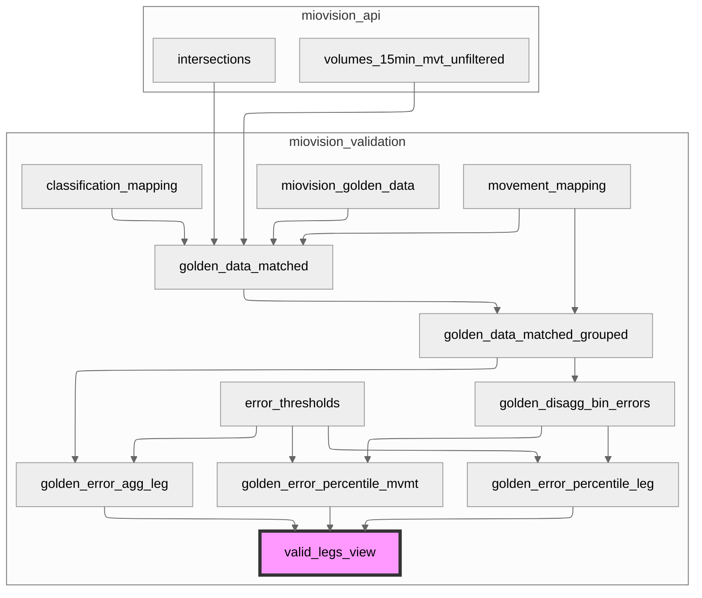
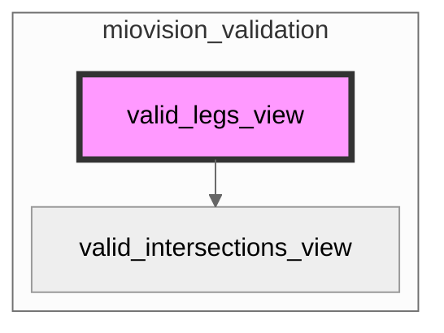
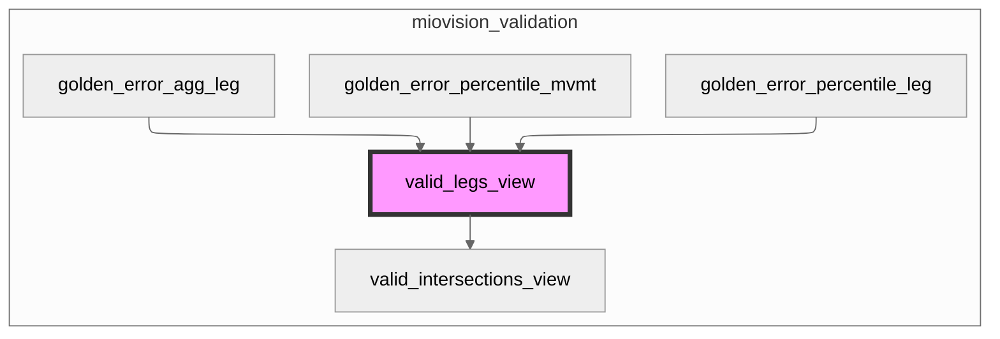

```mermaid
%%{init: {'theme': 'neutral', 'flowchart': {'defaultRenderer': 'elk'}}}%%
flowchart TD
    subgraph rapidto_new
        rapidto_new.miovision_volume_filtered[miovision_volume_filtered]
        rapidto_new.miovision_volume[miovision_volume]
    end
    subgraph aduyves
        aduyves.aadt_spatial_groups[aadt_spatial_groups]
    end
    subgraph activeto
        activeto.miovision_reporting_summary[miovision_reporting_summary]
    end
    subgraph aadt
        aadt.counts_miovision_mixed[counts_miovision_mixed]
    end
    subgraph miovision_api
        miovision_api.volumes_15min_atr_unfiltered[volumes_15min_atr_unfiltered]
        miovision_api.breaks[breaks]
        miovision_api.volumes_15min_mvt_unfiltered[volumes_15min_mvt_unfiltered]
        miovision_api.open_data_locations[open_data_locations]
        miovision_api.active_intersections[active_intersections]
        miovision_api.anomalous_ranges[anomalous_ranges]
        miovision_api.mio_dashboard_data[mio_dashboard_data]
        miovision_api.alerts[alerts]
        miovision_api.intersections[intersections]
        miovision_api.volumes_15min_mvt_filtered[volumes_15min_mvt_filtered]
    end
    subgraph whalabi
        whalabi.intersection_total_counts[intersection_total_counts]
    end
    subgraph monitoring
        monitoring.vi_sensors[vi_sensors]
    end
    subgraph nwessel
        nwessel.here_conflation[here_conflation]
    end
    subgraph dmcelroy
        dmcelroy.miovision_spectrum_qc_excel_file_output[miovision_spectrum_qc_excel_file_output]
        dmcelroy.miovision_golden_qc_excel_file_output[miovision_golden_qc_excel_file_output]
    end
    subgraph miovision_validation
        miovision_validation.summary_golden_count_info[summary_golden_count_info]
        miovision_validation.golden_data_matched_grouped[golden_data_matched_grouped]
        miovision_validation.spec_summary_table_step1[spec_summary_table_step1]
        miovision_validation.golden_summary_table_step1[golden_summary_table_step1]
        miovision_validation.spec_error_percentile_leg[spec_error_percentile_leg]
        miovision_validation.golden_summary_table_step2[golden_summary_table_step2]
        miovision_validation.miovision_golden_data[miovision_golden_data]
        miovision_validation.golden_error_agg_intersection[golden_error_agg_intersection]
        miovision_validation.golden_error_percentile_leg[golden_error_percentile_leg]
        miovision_validation.classification_mapping[classification_mapping]
        miovision_validation.valid_legs_view[valid_legs_view]
        miovision_validation.golden_error_agg_leg[golden_error_agg_leg]
        miovision_validation.valid_intersections_view[valid_intersections_view]
        miovision_validation.spec_error_agg_intersection[spec_error_agg_intersection]
        miovision_validation.golden_error_percentile_mvmt[golden_error_percentile_mvmt]
        miovision_validation.movement_mapping[movement_mapping]
        miovision_validation.mio_spec_intersections[mio_spec_intersections]
        miovision_validation.spec_error_percentile_mvmt[spec_error_percentile_mvmt]
        miovision_validation.error_thresholds[error_thresholds]
        miovision_validation.spec_error_agg_leg[spec_error_agg_leg]
        miovision_validation.golden_data_matched[golden_data_matched]
        miovision_validation.summary_intersection_count[summary_intersection_count]
        miovision_validation.golden_disagg_bin_errors[golden_disagg_bin_errors]
    end
    subgraph data_requests
        data_requests.i0772_king_street_through_volumes[i0772_king_street_through_volumes]
        data_requests.i0627_srt_miovision_tmc[i0627_srt_miovision_tmc]
        data_requests.i0624_miovision_tmu_tmc[i0624_miovision_tmu_tmc]
        data_requests.i0951_miovision_ped_volumes[i0951_miovision_ped_volumes]
        data_requests.i0843_location_info[i0843_location_info]
        data_requests.i0822_king_street_through_volumes[i0822_king_street_through_volumes]
        data_requests.i0802_2025_01_23_miotmc_sherbloor[i0802_2025_01_23_miotmc_sherbloor]
        data_requests.i0659_eg_allen_miovision_15min[i0659_eg_allen_miovision_15min]
        data_requests.i0718_2024_09_16_miovision_counts_on_bay[i0718_2024_09_16_miovision_counts_on_bay]
        data_requests.i0829_miovision_tmcs_on_adelaide[i0829_miovision_tmcs_on_adelaide]
        data_requests.i0822_king_violations_update[i0822_king_violations_update]
        data_requests.i0822_king_street_through_violations[i0822_king_street_through_violations]
    end
    miovision_api.intersections ----> rapidto_new.miovision_volume_filtered
    miovision_validation.movement_mapping --> miovision_validation.golden_data_matched
    miovision_validation.error_thresholds --> miovision_validation.spec_error_percentile_leg
    miovision_api.intersections ----> miovision_validation.golden_data_matched
    miovision_api.intersections ----> dmcelroy.miovision_spectrum_qc_excel_file_output
    miovision_api.intersections ----> data_requests.i0843_location_info
    miovision_validation.golden_error_percentile_leg --> miovision_validation.golden_summary_table_step2
    miovision_api.intersections ----> dmcelroy.miovision_golden_qc_excel_file_output
    miovision_validation.golden_error_percentile_leg --> miovision_validation.valid_legs_view
    miovision_api.intersections ----> miovision_validation.spec_error_percentile_mvmt
    miovision_validation.error_thresholds --> miovision_validation.golden_error_percentile_mvmt
    miovision_api.intersections ----> data_requests.i0659_eg_allen_miovision_15min
    miovision_validation.golden_data_matched_grouped ----> dmcelroy.miovision_golden_qc_excel_file_output
    miovision_api.volumes_15min_mvt_unfiltered ----> data_requests.i0772_king_street_through_volumes
    miovision_api.intersections ----> miovision_validation.spec_error_agg_intersection
    miovision_validation.error_thresholds --> miovision_validation.spec_error_agg_intersection
    miovision_validation.error_thresholds --> miovision_validation.golden_error_percentile_leg
    miovision_validation.valid_legs_view --> miovision_validation.valid_intersections_view
    miovision_api.intersections --> |miovision_qc_intersection_uid_fkey
intersection_uid->intersection_uid|miovision_api.anomalous_ranges
    miovision_api.intersections ----> rapidto_new.miovision_volume
    miovision_api.intersections ----> monitoring.vi_sensors
    miovision_validation.golden_error_percentile_mvmt --> miovision_validation.valid_legs_view
    miovision_api.volumes_15min_mvt_unfiltered ----> data_requests.i0822_king_violations_update
    miovision_api.intersections ----> data_requests.i0718_2024_09_16_miovision_counts_on_bay
    miovision_validation.error_thresholds --> miovision_validation.spec_error_agg_leg
    miovision_validation.golden_error_percentile_mvmt ----> dmcelroy.miovision_golden_qc_excel_file_output
    miovision_api.intersections ----> activeto.miovision_reporting_summary
    miovision_validation.golden_disagg_bin_errors --> miovision_validation.golden_error_percentile_mvmt
    miovision_validation.golden_data_matched_grouped --> miovision_validation.golden_error_agg_leg
    miovision_api.intersections ----> miovision_validation.mio_spec_intersections
    miovision_api.intersections --> |miovision_breaks_intersection_uid_fkey
intersection_uid->intersection_uid|miovision_api.breaks
    miovision_api.intersections ----> miovision_validation.spec_error_percentile_leg
    miovision_validation.movement_mapping --> miovision_validation.golden_data_matched_grouped
    miovision_api.volumes_15min_mvt_unfiltered ----> data_requests.i0822_king_street_through_volumes
    miovision_validation.error_thresholds --> miovision_validation.spec_error_percentile_mvmt
    miovision_api.intersections ----> data_requests.i0829_miovision_tmcs_on_adelaide
    miovision_validation.golden_error_agg_leg --> miovision_validation.valid_legs_view
    miovision_api.volumes_15min_mvt_unfiltered ----> data_requests.i0627_srt_miovision_tmc
    miovision_validation.miovision_golden_data --> miovision_validation.summary_golden_count_info
    miovision_api.intersections ----> miovision_validation.spec_summary_table_step1
    miovision_validation.miovision_golden_data --> miovision_validation.golden_data_matched
    miovision_validation.golden_data_matched_grouped ----> whalabi.intersection_total_counts
    miovision_api.intersections ----> miovision_validation.summary_golden_count_info
    miovision_validation.golden_data_matched_grouped --> miovision_validation.golden_disagg_bin_errors
    miovision_api.intersections ----> data_requests.i0951_miovision_ped_volumes
    miovision_validation.miovision_golden_data --> miovision_validation.summary_intersection_count
    miovision_api.intersections --> miovision_api.active_intersections
    miovision_validation.golden_data_matched --> miovision_validation.golden_data_matched_grouped
    miovision_api.intersections ----> |here_conflation_intersection_uid_fkey
intersection_uid->intersection_uid|nwessel.here_conflation
    miovision_api.intersections --> miovision_api.open_data_locations
    miovision_api.intersections --> miovision_api.mio_dashboard_data
    miovision_api.intersections ----> aduyves.aadt_spatial_groups
    miovision_api.intersections ----> miovision_validation.summary_intersection_count
    miovision_validation.golden_error_percentile_leg ----> dmcelroy.miovision_golden_qc_excel_file_output
    miovision_validation.error_thresholds --> miovision_validation.golden_error_agg_intersection
    miovision_api.intersections ----> data_requests.i0802_2025_01_23_miotmc_sherbloor
    miovision_api.intersections ----> aadt.counts_miovision_mixed
    miovision_api.volumes_15min_mvt_unfiltered ----> data_requests.i0624_miovision_tmu_tmc
    miovision_validation.golden_disagg_bin_errors --> miovision_validation.golden_error_percentile_leg
    miovision_api.intersections ----> miovision_validation.spec_error_agg_leg
    miovision_api.intersections --> |miov_alert_intersection_fkey_new
intersection_uid->intersection_uid|miovision_api.alerts
    miovision_validation.classification_mapping --> miovision_validation.golden_data_matched
    miovision_validation.golden_error_agg_leg --> miovision_validation.golden_summary_table_step2
    miovision_api.volumes_15min_mvt_unfiltered --> miovision_api.volumes_15min_mvt_filtered
    miovision_api.volumes_15min_mvt_unfiltered ----> data_requests.i0718_2024_09_16_miovision_counts_on_bay
    miovision_validation.golden_disagg_bin_errors --> miovision_validation.golden_summary_table_step1
    miovision_validation.golden_error_percentile_mvmt --> miovision_validation.golden_summary_table_step2
    miovision_api.volumes_15min_mvt_unfiltered ----> data_requests.i0802_2025_01_23_miotmc_sherbloor
    miovision_api.volumes_15min_mvt_unfiltered --> miovision_api.volumes_15min_atr_unfiltered
    miovision_api.intersections ----> data_requests.i0822_king_street_through_violations
    miovision_api.volumes_15min_mvt_unfiltered ----> miovision_validation.golden_data_matched
    miovision_validation.golden_data_matched_grouped --> miovision_validation.golden_error_agg_intersection
    miovision_validation.error_thresholds --> miovision_validation.golden_error_agg_leg
        style miovision_validation.valid_legs_view fill:#f9f,stroke:#333,stroke-width:4px,color:black
```

# Mermaid Diagrams in Postgres

The function `public.mermaid_dependency_diagram` can be used to create mermaid diagrams of objects and their dependents/dependencies.
- Paste the resulting diagrams into `mermaid` code blocks to render inside of `.md` files.
  - Note: the formatting is prettier if you view the diagrams on https://mermaid.ai/live/ instead of github, because it renders the "ELK" theme, which is better for complex diagrams. 
- Explore the following parameters:
  - `input_obj`: schema qualified object to base tree around (eg. `'miovision_validation.valid_legs_view'`)
  - `recursive_direction`: `'up'` to find parents, `'down'` to find children, or `'both'`
  - `simple_diagram`: `False` to also traverse one level up from each object in the core tree. `True` to turn this feature off. 

## Examples

```sql
SELECT public.mermaid_dependency_diagram(
    input_obj:='miovision_validation.valid_legs_view',
    recursive_direciton:='up',
    simple_diagram:=True
)
```



```sql
SELECT public.mermaid_dependency_diagram(
    input_obj:='miovision_validation.valid_legs_view',
    recursive_direciton:='down',
    simple_diagram:=True
)
```



```sql
SELECT public.mermaid_dependency_diagram(
    input_obj:='miovision_validation.valid_legs_view',
    recursive_direciton:='down',
    simple_diagram:=False
)
```



```sql
SELECT public.mermaid_dependency_diagram(
    input_obj:='miovision_validation.valid_legs_view',
    recursive_direciton:='both',
    simple_diagram:=False
)
```


